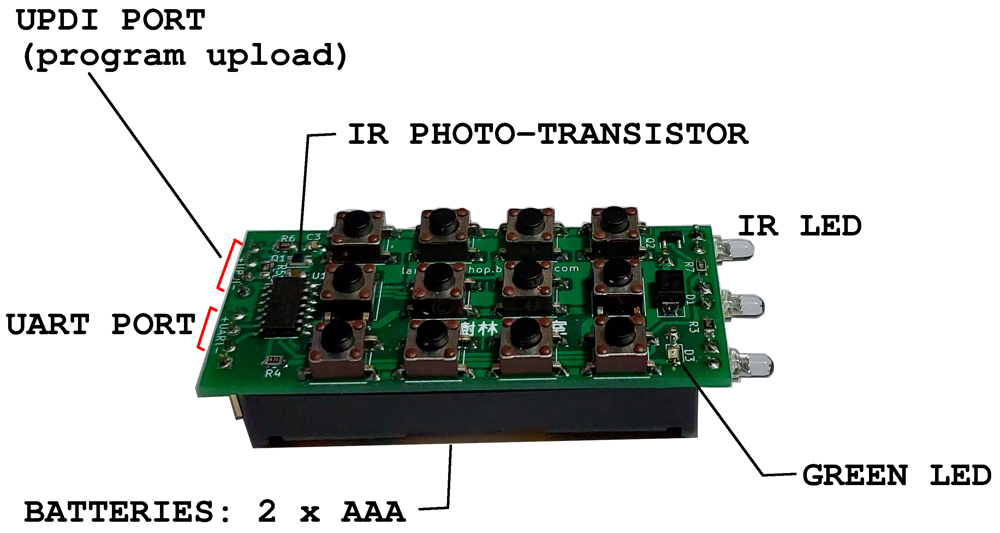
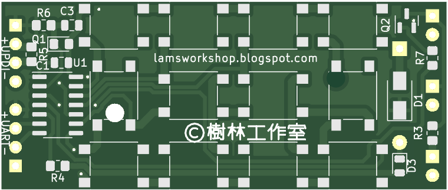
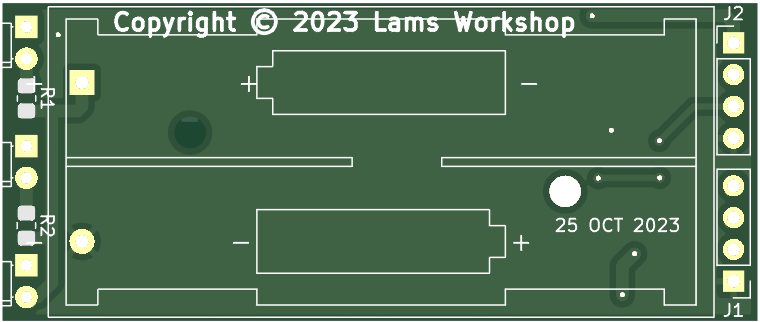
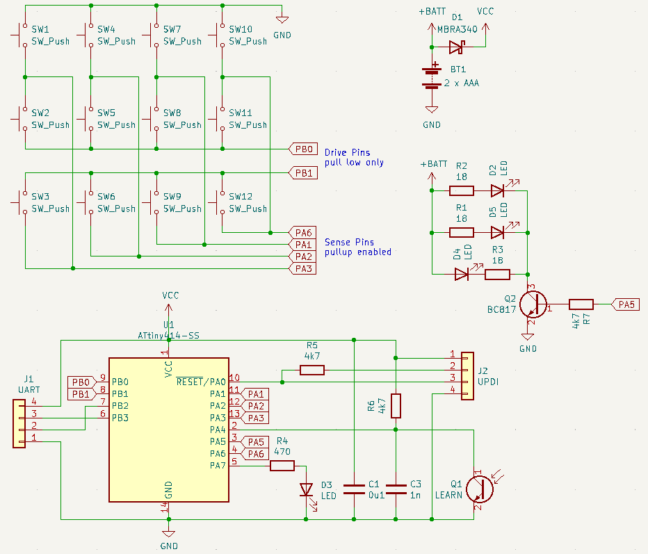

# tinyRemote
- A 12 keys IR remote controller using ATTINY414, with learning capability
- Designed for soldering practice
- Reference code in directories "remote" and "learn"
- bare pcd available at [TINDIE](https://www.tindie.com/stores/dgtie/)

### Annotation

### PCB Top view

### PCB Bottom view

### Schematic

### BOM
                    
Description  | Package | Quantity | Designator
------------- | ------------- | ---:| --- |
Tactile switch | smd 6 x 6 | 12 |
npn transistor BC817  | SOT-23 | 1 | Q2
LED green | 0805 | 1 | D3
Ceramic capacitor, 1nF | 0805 | 1 | C3
Ceramic capacitor, 1uF | 0805 | 1 | C1
Micro-controller ATTINY414-SS | SOIC-14 | 1 | U1
Resistor 4k7 | 0805 | 3 | R5, R6, R7
Resistor 18 ohm | 0805 | 3 | R1, R2, R3
Resistor 470 ohm | 0805 | 1 | R4
Diode Schottky, MBRA340 | SMA | 1 | D1
IR photo-transistor, PT17-21B | 0805 | 1 | Q1
IR LED | D=3mm | 3 | D2, D4, D5
Pin Header 1 x 4, pitch 2.54 mm, straight ||2| J1, J2
Battery holder, 2 x AAA, Keystone 2468 || 1 |

### UPDI/UART to CP2102(usb2ttl) connection

| UPDI | UART | CP2102
| --- | --- | --- |
| + | + | 3V3
| 4k7 | RXD | TXD
| UPDI | TXD | RXD
| - | - | GND
